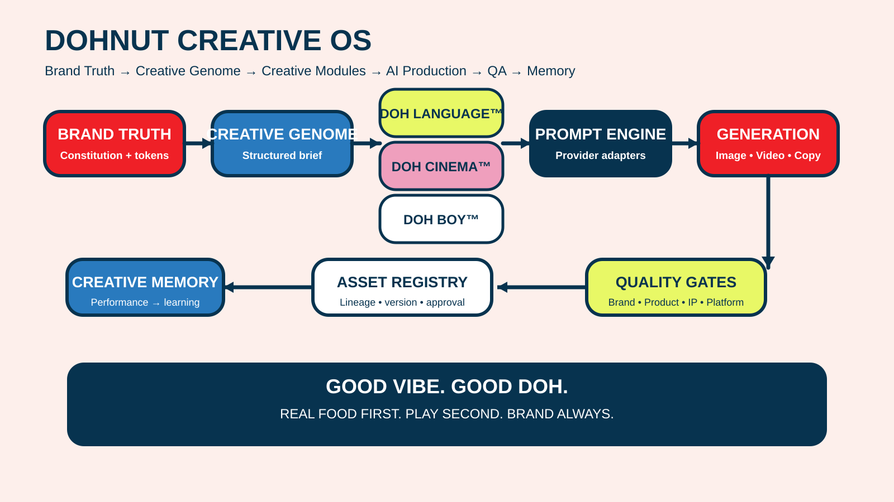

# DOHNUT Markdown Authoring Standard

## 1. Purpose

Dokumen ini menetapkan standard penulisan Markdown untuk semua dokumentasi DOHNUT Creative OS supaya fail boleh dibaca manusia, dirender dengan betul di GitHub, mudah dinavigasi dan boleh divalidasi secara automatik.

## 2. Rendering target

Gunakan **GitHub Flavored Markdown (GFM)** untuk fail repository-facing. GitHub menyokong headings, links, relative links, images, lists, task lists, tables, code blocks dan alerts. Rujuk [GitHub Markdown documentation](https://docs.github.com/en/get-started/writing-on-github/getting-started-with-writing-and-formatting-on-github/basic-writing-and-formatting-syntax).

## 3. Front matter

Semua machine-facing documents di bawah `docs/` mesti bermula dengan YAML front matter.

```yaml
---
title: "Document title"
date: "2026-08-31"
version: "1.0.0"
author: "GangNiaga Sdn. Bhd. / DOHNUT"
status: "draft"
tags: [example]
related_documents:
  - "../00-system-index.md"
---
```

`README.md` root tidak diwajibkan menggunakan front matter kerana ia ialah repository landing page; metadata projek yang diperlukan untuk rendering di GitHub diletakkan dalam kandungan README.

## 4. Heading hierarchy

- H1: satu sahaja, untuk tajuk dokumen.
- H2: bahagian utama.
- H3: sub-bahagian.
- H4: detail jika benar-benar diperlukan.
- Jangan melangkau tahap heading.

## 5. Paragraphs and emphasis

Gunakan ayat aktif dan istilah terkawal. Gunakan **bold** untuk istilah utama dan *italic* untuk penekanan. Elakkan penggunaan ALL CAPS berlebihan kecuali untuk nama campaign, tagline atau constant yang memang ditetapkan begitu.

## 6. Tables

Gunakan jadual untuk data berstruktur. Letakkan blank line sebelum jadual dan gunakan header yang deskriptif.

```markdown
| **Field** | **Value** |
| --- | --- |
| Version | 1.0.0 |
| Status | approved |
```

## 7. Code blocks

Gunakan fenced code blocks dengan language identifier yang tepat.

```python
print("GOOD VIBE. GOOD DOH.")
```

## 8. Links

Untuk fail dalam repository, gunakan **relative links** supaya pautan kekal berfungsi selepas repository diclone atau branch ditukar.

```markdown
[System Index](../00-system-index.md)
```

Untuk sumber luar, gunakan descriptive link text dan bukan URL mentah.

## 9. Images

Gunakan relative image paths untuk asset dalam repository dan alt text yang menerangkan kandungan visual.

```markdown

```

GitHub menyokong embedding image dalam `.md` dan mengesyorkan relative links bagi image yang berada dalam repository. Rujuk [GitHub image guidance](https://docs.github.com/en/get-started/writing-on-github/getting-started-with-writing-and-formatting-on-github/basic-writing-and-formatting-syntax).

## 10. Lists

Gunakan numbered lists untuk prosedur berurutan dan bullet lists untuk set item. Hadkan nested depth kepada tiga tahap.

## 11. Alerts

Gunakan GitHub alerts hanya untuk perkara yang benar-benar penting.

```markdown
> [!IMPORTANT]
> This is required before release.

> [!WARNING]
> This may create an IP or regulatory risk.
```

## 12. Anchors and navigation

Gunakan heading yang jelas untuk membolehkan GitHub menghasilkan section anchors. Gunakan internal links apabila navigation merentasi dokumen membantu pembaca.

## 13. File naming

Gunakan lowercase kebanyakannya, hyphen-separated dan semantic versioning apabila dokumen versioned.

```text
prompt-content-generation-v1.0.0.md
quality-gates-v1.0.0.md
asset-registry-v1.0.0.md
```

## 14. Quality checklist

- [ ] YAML front matter sah.
- [ ] H1 tunggal dan hierarchy tidak melangkau.
- [ ] Semua code blocks mempunyai language tag.
- [ ] Relative internal links digunakan.
- [ ] Image paths valid dan mempunyai alt text.
- [ ] Tables mempunyai blank line sebelum table.
- [ ] Istilah selaras dengan glossary.
- [ ] Version dan changelog selaras.
